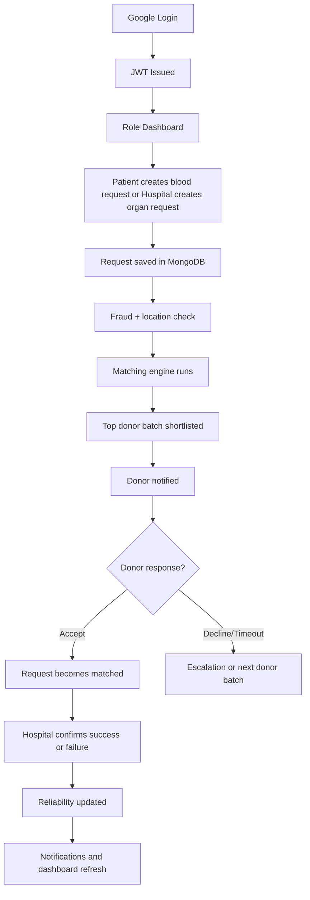

# BIO SYNC: Full Working, Flow, and Integration Notes

This file explains the project from the code level:

- how login works
- how each role behaves
- what happens when a patient or hospital creates a request
- how donors are matched
- how notifications move through the system
- how location is handled
- how the new Google Maps location picker fits in
- what flaw existed in the original flow
- what is fixed now
- what is still not implemented yet

## 1. High-Level Idea

This project is a role-based emergency donation platform with four main actors:

- `donor`
- `patient`
- `hospital`
- `admin`

Core purpose:

- patients can create `blood` requests
- hospitals can create `organ` requests after verification
- donors receive shortlisted requests based on blood group, organ preference, distance, availability, and reliability
- admins verify hospitals, review suspicious activity, and control blocked/suspended users

The project is split into:

- `backend/` for API, business logic, matching, jobs, notifications, and MongoDB models
- `frontend/` for dashboards and role-specific UI

## 2. Real Architecture in This Repo

Backend structure:

- `backend/src/models/` stores MongoDB schemas
- `backend/src/controllers/` handles request/response logic
- `backend/src/routes/` exposes role-specific endpoints
- `backend/src/services/` contains business logic such as matching, audit logs, fraud checks, notifications, profile sync, and reliability scoring
- `backend/src/jobs/` runs background workers
- `backend/src/utils/` contains compatibility, geo, JWT, constants, and scoring helpers

Frontend structure:

- `frontend/src/pages/` contains role dashboards
- `frontend/src/api/client.js` configures Axios and automatically sends auth token plus client coordinates
- `frontend/src/context/AuthContext.jsx` stores login state
- `frontend/src/components/GoogleMapPicker.jsx` is the new reusable Google Maps-based location picker

## 3. Database Models and What They Mean

### `User`

This is the main account table for all roles.

It stores:

- login identity: email, name, picture, googleId
- role: donor/patient/hospital/admin
- status: active/suspended/blocked
- donor fields: bloodGroup, organPreferences, availabilityStatus, reliabilityScore
- geo fields: `locationCoordinates` as GeoJSON point `[lng, lat]`
- security flags

This is the model most of the modern business logic uses.

### `DonorProfile`

This is a legacy-compatible donor profile collection.

The code still syncs it so older data is not lost, but the rich matching logic mainly depends on `User`.

### `HospitalProfile`

This stores hospital verification data:

- hospital name
- registration number
- address/city/state/pincode
- documents
- verification status
- location

### `Request`

This is the central emergency request model.

It stores:

- request creator
- hospital handling the request
- patient if applicable
- request type: `blood` or `organ`
- required blood group
- organ type if needed
- urgency
- exact request location
- status: `pending`, `matched`, `completed`, `cancelled`
- matched donor
- escalation metadata like radius and next escalation time

### `Match`

This stores every donor shortlist record for a request.

It tracks:

- donor
- request
- ranking score
- distance
- batch number
- response deadline
- status: `notified`, `accepted`, `declined`, `expired`, `cancelled`

### `Notification`

This stores in-app notifications and optional email-delivery state.

### `AuditLog`

This stores important actions such as:

- registration
- profile changes
- hospital verification
- match creation
- donor response
- reliability changes
- fraud flags

## 4. Authentication Flow

Authentication is Google OAuth based.

Real flow:

1. Frontend login page uses Google sign-in.
2. Frontend sends Google `idToken` to `POST /api/auth/google`.
3. Backend verifies the token in `backend/src/config/googleAuth.js`.
4. If user already exists, backend updates Google-linked info if needed.
5. If user is new, backend creates the account only if the selected role is one of:
   - donor
   - patient
   - hospital
6. Backend issues JWT.
7. Frontend stores JWT and sends it in future requests.

Important rule:

- admin is not self-registered from the UI
- admin is seeded from backend CLI script

## 5. Role Rules

### Donor

- can complete donor profile
- can set blood group
- can set organ preferences
- can set availability
- receives shortlisted notifications
- can accept or decline a match

### Patient

- can create only `blood` requests
- must route the request to a verified hospital
- can track request status live

### Hospital

- must first complete verification profile
- must be admin-approved before creating organ requests
- can create only `organ` requests
- can mark donation completed
- can mark donor no-show or late cancellation

### Admin

- verifies hospitals
- reviews users
- blocks/suspends users
- sees security flags and audit logs

## 6. Runtime Flow: What Actually Happens

This is the exact current flow in the code.

### A. Patient blood request flow

1. Patient opens dashboard.
2. Patient selects a verified hospital.
3. Patient fills blood group, urgency, notes, units, and location.
4. Frontend sends data to `POST /api/patient/requests`.
5. Backend validates:
   - request type must be `blood`
   - hospital must exist
   - hospital must be verified
   - blood group must be valid
   - request location must exist
6. Backend stores the request in `Request`.
7. Fraud service checks whether request location mismatches the account or client location too heavily.
8. Audit log is created.
9. Backend immediately starts matching with `runMatchingForRequest`.

### B. Hospital organ request flow

1. Hospital completes verification profile.
2. Admin approves hospital.
3. Hospital opens organ request form.
4. Frontend sends request to `POST /api/hospital/requests`.
5. Backend validates:
   - hospital user is verified
   - hospital profile exists
   - hospital profile verification status is `verified`
   - organ type and blood group exist
   - location exists
6. Request is stored.
7. Fraud/location mismatch check runs.
8. Audit log is created.
9. Matching starts immediately.

### C. Matching flow

When `runMatchingForRequest(requestId)` runs:

1. Backend loads full request context.
2. It ignores requests that are not `pending` or already have a matched donor.
3. It expires old shortlisted donors whose response timeout already passed.
4. It chooses current active search radius:
   - first run uses `INITIAL_RADIUS_KM`
   - later runs use request's stored `searchRadiusKm`
5. It finds eligible donors with MongoDB geospatial search.
6. It filters donors by:
   - role must be donor
   - status must be active
   - blood group compatibility
   - organ preference compatibility for organ requests
   - availability
   - mandatory medical waiting period
7. It scores donors using:
   - urgency
   - distance
   - reliability score
   - availability context
8. It sorts donors by score.
9. It notifies only the top batch.
10. It stores `Match` records.
11. It writes request escalation timing for future background checks.

### D. Donor response flow

When donor sees an incoming match:

1. Donor clicks `Accept` or `Decline`.
2. Frontend calls `POST /api/donor/matches/:matchId/respond`.
3. Backend converts that into `acceptMatch` or `declineMatch`.

If donor accepts:

1. Match status becomes `accepted`.
2. Request status becomes `matched`.
3. Request gets `matchedDonorId`.
4. Other pending notified matches for the same request are cancelled.
5. Notifications are sent to:
   - requester
   - patient
   - hospital user

If donor declines:

1. Match becomes `declined`.
2. Request remains `pending`.
3. `nextEscalationAt` is pushed to `now`, so the engine can continue quickly.

### E. Hospital completion flow

Once request is `matched`, hospital can:

- confirm success
- mark donor no-show
- mark late cancellation

On success:

1. Request becomes `completed`.
2. Donor reliability increases.
3. Donor gets busy status.
4. Waiting-period reset time is stored.
5. Notifications go out.

On failure:

1. Request becomes `cancelled`.
2. Donor may be penalized depending on reason.
3. Notifications go out.

## 7. Notification Flow

Current notification behavior:

### When donor is shortlisted

- donor gets in-app notification
- donor may get email if email config exists

### When donor accepts

- requester gets notification
- patient gets notification
- hospital user gets notification

### When donation is completed or cancelled

- requester gets notification
- patient gets notification
- donor gets notification

Important current behavior:

- hospital is notified after donor acceptance
- there is no separate hospital-side "accept donor candidate" step in the current codebase

## 8. Background Jobs

There are two important jobs running in the backend.

### Request escalation job

This runs on an interval and looks for pending requests whose `nextEscalationAt` time has arrived.

It:

1. increases search radius
2. increases escalation level
3. runs another shortlist batch

This is how the system expands donor search over time.

### Donor availability reset job

This runs on an interval and looks for donors whose waiting period is complete.

It:

1. changes donor from `busy` back to `available`
2. clears `availabilityResetAt`
3. now also re-checks pending requests immediately for that donor

## 9. Location Flow

Location is very important in this system.

### Backend location format

All important location fields are stored as GeoJSON:

```json
{
  "type": "Point",
  "coordinates": [longitude, latitude]
}
```

### Where location is used

- donor profile location
- hospital profile location
- patient blood request location
- hospital organ request location
- donor geo search with MongoDB `$geoNear`
- fraud mismatch detection
- donor ranking score

### Existing behavior before Google Maps integration

Before the new UI update, location capture worked like this:

- browser geolocation fetched raw coordinates
- coordinates were stored in local storage
- forms displayed coordinate values as text
- backend already used those coordinates for geo matching

So the matching engine already supported location, but the UX was plain and not visual.

## 10. Google Maps Integration Added

The new frontend now includes a reusable map picker:

- `frontend/src/components/GoogleMapPicker.jsx`

It is now used in:

- donor profile form
- hospital verification profile form
- hospital organ request form
- patient blood request form

What it does:

- loads Google Maps JavaScript API on the frontend
- lets user search a place on the map
- lets user click map to choose location
- lets user drag marker
- lets user use current browser location
- stores coordinates in the same format the backend already expects

Why this is a clean integration:

- backend did not need a major location rewrite
- MongoDB geo matching remains unchanged
- only the UX for choosing coordinates improved

### Frontend env needed

Add this in `frontend/.env`:

```env
VITE_GOOGLE_MAPS_API_KEY=your-google-maps-api-key
```

Google OAuth still remains separate:

```env
VITE_GOOGLE_CLIENT_ID=your-google-oauth-client-id.apps.googleusercontent.com
```

## 11. The Flaw You Pointed Out

Your observation was correct.

Original gap:

1. Hospital or patient creates request.
2. No donor is currently available.
3. Request stays pending and waits for timed escalation.
4. Later, a new donor joins or an existing donor becomes available.
5. System did **not** immediately re-check pending requests just because that donor became newly eligible.

That means the request could remain stale until the next scheduled matching/escalation cycle.

## 12. What Is Fixed Now

This is now improved with a reactive rematch flow.

New behavior:

- when donor updates profile and is `available`, pending requests are re-checked
- when donor availability is changed to `available`, pending requests are re-checked
- when background job automatically resets donor from `busy` to `available`, pending requests are re-checked

Important detail:

This re-check is intentionally safe.

It only immediately re-runs matching for requests where:

- request is still `pending`
- request has no matched donor yet
- donor is actually compatible and within the request's active search radius
- request does not already have an active shortlist batch still waiting for donor response

Why this matters:

- it fixes the "no donor was available earlier, but a new donor appeared later" problem
- it does not spam extra donor batches while another shortlist window is still active

## 13. What Still Does Not Exist Yet

This is the most important design clarification.

### Current implemented flow

`request -> donor shortlist -> donor accepts -> hospital sees matched donor -> hospital confirms outcome`

### Workflow you asked about

You described this possible flow:

`request -> system finds donor later -> hospital reviews/selects donor -> donor gets notification -> donor accepts`

That hospital-first approval step is **not implemented yet**.

Right now:

- hospital cannot manually accept a donor candidate before donor is notified
- hospital only sees ranked donors/matches and then handles outcome after donor accepts

If you want that workflow, we should add a second-stage approval model.

## 14. Recommended Future Enhancement for Hospital Approval Workflow

If we implement your desired flow, the clean version would be:

1. request created
2. system generates candidate donors
3. hospital sees `candidate` list
4. hospital clicks `select donor`
5. donor receives `hospital_selected_you` notification
6. donor accepts or declines
7. request becomes `matched`

That would require:

- a new match status such as `candidate` or `awaiting_hospital_approval`
- a new hospital action endpoint
- a new donor notification type
- updated UI in hospital dashboard
- slight change in current notification order

This is a separate enhancement from the reactive rematch fix.

## 15. End-to-End Flow Summary in One View



## 16. Files Most Important for Understanding the System

- `backend/src/controllers/authController.js`
- `backend/src/controllers/donorController.js`
- `backend/src/controllers/patientController.js`
- `backend/src/controllers/hospitalController.js`
- `backend/src/services/requestService.js`
- `backend/src/services/matchingService.js`
- `backend/src/services/notificationService.js`
- `backend/src/services/reliabilityService.js`
- `backend/src/services/reactiveMatchingService.js`
- `backend/src/services/fraudService.js`
- `backend/src/models/User.js`
- `backend/src/models/Request.js`
- `backend/src/models/Match.js`
- `frontend/src/pages/donor/DonorDashboardView.jsx`
- `frontend/src/pages/patient/PatientDashboardView.jsx`
- `frontend/src/pages/hospital/HospitalDashboardView.jsx`
- `frontend/src/components/GoogleMapPicker.jsx`

## 17. Final Practical Answer to Your Question

Yes, your understanding was right:

- if no donor was available earlier, the hospital/request flow should react when a newly eligible donor appears
- hospital should be updated with that new match information

The repo now handles the first part much better through reactive re-matching.

But for the second part:

- current system does **not** have a hospital-first donor acceptance workflow
- current system is still donor-first

So the system now behaves like this:

- new eligible donor appears
- matching can re-run immediately for suitable pending requests
- donor gets shortlisted
- if donor accepts, hospital gets notified and sees the matched donor

If you want, the next step I can help with is:

1. add the full hospital-approval-before-donor-notification workflow
2. add map-based reverse geocoding/address autofill
3. add route distance and nearest-hospital suggestions
